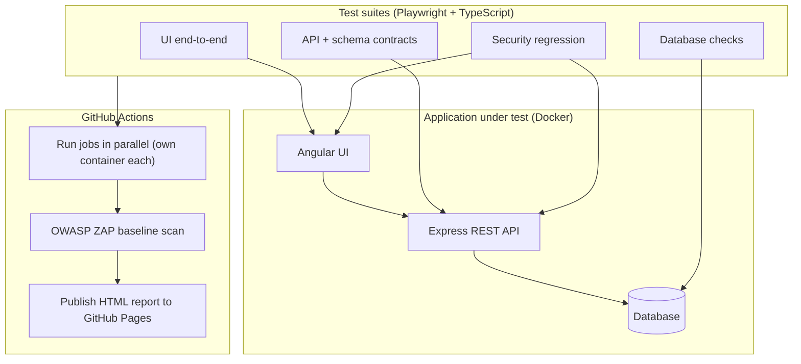

# OWASP Juice Shop: QA Automation Suite

<!-- TODO: replace [your-username]/[repo] with your real path once the repo exists -->
[](https://github.com/[your-username]/[repo]/actions/workflows/ci.yml)
[](https://[your-username].github.io/[repo]/)

An end-to-end QA automation suite for a real full-stack e-commerce application, covering **UI, API, and database** testing, plus **automated security regression** and a **DAST scan in CI**. Built to demonstrate modern, security-aware quality engineering on a system complex enough to be credible.

The application under test is [OWASP Juice Shop](https://owasp.org/www-project-juice-shop/), a deliberately insecure storefront maintained by the OWASP Foundation as a sanctioned training target.

---

## What this is

A working test suite that exercises one coherent application across every layer: the Angular UI, the REST API beneath it, and the database beneath that. On top of the functional coverage, it includes a curated set of automated security checks and a passive security scan wired into continuous integration.

It is the work of a QA engineer who automates, validates, and thinks in terms of risk, not a manual-only tester and not a penetration tester. The thinking behind every choice lives in **[docs/test-strategy.md](docs/test-strategy.md)**.

## What this demonstrates

- **Hybrid functional automation.** UI end-to-end tests with the Page Object Model, plus API-level tests, against the same application.
- **Full-stack data integrity.** A three-way consistency check that confirms the UI, API, and database all agree after a write.
- **Security-aware QA.** Automated regression for a curated set of OWASP Top 10 vulnerability classes, written to document risk and to guard the fix once applied. This is regression testing of known issues, not an audit.
- **Modern delivery practice.** Everything runs in CI on every change, in a disposable container, with a published report anyone can view from a link.
- **Judgment under real constraints.** Deliberate handling of the app's self-healing reseed and single-user design (see the strategy doc).
- **AI in the loop, with a human judge.** AI-assisted test drafting, with every generated case validated against real behavior and misses logged in `docs/ai-validation-log.md`.

## Architecture



## Tech stack

| Area | Tools |
|------|-------|
| UI and API automation | Playwright, TypeScript |
| API collection (planned) | Postman, Newman |
| Contract validation | Zod schemas |
| Database assertions | SQL via Node client |
| Security scanning | OWASP ZAP (baseline) |
| Environment | Docker Compose |
| CI and reporting | GitHub Actions, GitHub Pages |

## Test coverage

| Layer | What it covers |
|-------|----------------|
| UI end-to-end | Register and login, browse and search, basket, checkout, reviews |
| API | The same operations at the service level, with status, auth, and contract checks |
| Database | Persistence and the three-way UI/API/DB consistency check |
| Security regression | Curated cases: SQL injection, broken access control (basket IDOR), DOM XSS, sensitive data exposure, and LLM prompt injection (chatbot) |
| DAST | OWASP ZAP baseline scan in CI |

Full rationale, the risk matrix, and the curated vulnerability list are in **[docs/test-strategy.md](docs/test-strategy.md)**.

## Live test report

<!-- TODO: paste the GitHub Pages URL once CI has published once -->
The latest run publishes here: **[live report](https://[your-username].github.io/[repo]/)** (pass/fail, traces, and screenshots, no clone required).

## Bugs found

<!-- TODO: link real issues as you file them -->
Real defects found while testing are written up in **[docs/bugs/](docs/bugs/)** and filed as [GitHub Issues](https://github.com/[your-username]/[repo]/issues). Each report includes steps, expected versus actual, and severity.

## Quick start

Gets you from clone to a passing run in a few minutes.

**Prerequisites:** Docker, Node.js 24 or newer, and Git.

```bash
# 1. Clone
git clone https://github.com/[your-username]/[repo].git
cd [repo]

# 2. Start the application under test (http://localhost:3000)
docker compose up -d --wait

# 3. Install test dependencies and browsers
npm ci
npx playwright install --with-deps

# 4. Configure (copy the example and adjust if needed)
cp .env.example .env

# 5. Run the suite
npx playwright test

# 6. Open the report
npx playwright show-report
```

Run a single layer:

```bash
npx playwright test tests/api      # API only
npx playwright test tests/ui       # UI only
npx playwright test tests/db       # database only
npx playwright test tests/security # security regression only
```

## A note on the security tests

This suite runs only against your own local or CI instance of Juice Shop, which is exactly what the application is built for. Running in a container also disables the genuinely dangerous challenges automatically. The security tests are defensive regression checks against a deliberately vulnerable training app. They are not tools for use against any system you do not own.

## Project structure

```
.
├── docs/
│   ├── test-strategy.md         # the thinking: scope, risk matrix, decisions
│   ├── security-regression.md   # the curated vulnerability cases
│   ├── ai-validation-log.md     # where AI got it wrong, and the fixes
│   └── bugs/                    # written bug reports
├── src/
│   ├── pages/                   # Page Object Model
│   ├── fixtures/                # auth, DB connection, fresh-instance setup
│   ├── api/                     # typed API clients
│   └── schemas/                 # Zod response schemas
├── tests/
│   ├── ui/
│   ├── api/
│   ├── db/
│   └── security/
├── postman/                     # Newman collection (planned)
├── .github/workflows/ci.yml     # functional suite + ZAP scan + report publish
├── playwright.config.ts
├── docker-compose.yml
├── .env.example
└── README.md
```

## Key decisions

A few choices worth surfacing, with full reasoning in the [strategy doc](docs/test-strategy.md):

- The app reseeds itself on every restart, so each CI run uses a fresh container for deterministic, known-good data.
- The app is single-user per instance, so tests run serially against one instance (workers = 1); parallelism comes from separate CI jobs and containers, not more workers.
- Security tests are written in two paired styles: one that confirms the vulnerability exists, and one that asserts the secure target state and flips to passing once the issue is fixed.

## About

<!-- TODO: your details -->
Built by **[YOUR NAME]**, QA engineer. [LinkedIn](#) · [Email](#)
